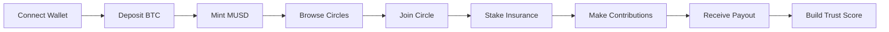

# 🦁 Leo Finance - Bitcoin-Backed Lending Circles on Mezo


**Decentralized Lending Circles (ROSCA) powered by Mezo's MUSD stablecoin**

Leo Finance brings traditional rotating savings and credit associations (ROSCAs) to Web3, combining Bitcoin collateralization with community-based lending. Built for the **Mezo Hackathon - Financial Access & Mass Adoption Track**.

## 🎯 Overview

Leo Finance enables users to:
- 💰 Deposit BTC as collateral to mint MUSD (1% borrowing rate)
- 🔄 Create or join lending circles with monthly contributions
- 📊 Build an on-chain trust score (0-1000 points)
- 🛡️ Benefit from automatic insurance protection (10-20% stake)
- 📈 Earn DeFi yield on idle funds
- 🎁 Receive bonuses for completing circles successfully

## ✨ Key Features

### 1. Bitcoin Collateralization
- Deposit BTC to mint MUSD at 1% annual rate
- Maintain healthy collateralization ratios (150% minimum)
- Real-time liquidation risk monitoring
- Non-custodial - you keep your BTC

### 2. Trust Score System
Four-tier reputation system (Newcomer → Silver → Gold → Platinum):

| Tier | Score Range | Monthly Limit | Benefits |
|------|------------|---------------|----------|
| 🆕 Newcomer | 0-249 | Up to $200 | Entry level access |
| 🥈 Silver | 250-499 | Up to $500 | Medium circles |
| 🥇 Gold | 500-749 | Up to $2,000 | Large circles |
| 💎 Platinum | 750-1000 | Unlimited | Premium + governance |

**Score Calculation:**
- 40% Payment Reliability (on-time vs late payments)
- 30% Circle Completions (completed vs defaulted)
- 20% DeFi History (Mezo protocol interactions)
- 10% Social Verification (optional KYC/identity proofs)

### 3. Lending Circles
- Create custom circles with:
  - Contribution amount ($50+)
  - Duration (3-24 months)
  - Member count (3-20)
  - Required trust score threshold
- Automatic monthly payout rotation
- Transparent on-chain history

### 4. Economic Safety Net
- **Insurance Pool**: 10-20% stake covers defaults
- **Yield Generation**: Idle funds earn 5% APY
- **Default Protection**: Automatic coverage from insurance
- **Completion Bonus**: Refund + yield bonus for good actors

## 🏗️ Architecture

### Smart Contracts

```
contracts/
├── CircleFactory.sol      # Main circle management
├── TrustScore.sol        # Reputation system
├── InsurancePool.sol     # Default protection
├── YieldManager.sol      # DeFi yield strategies
├── MUSDIntegration.sol   # BTC collateral management
└── MockMUSD.sol          # Test MUSD token
```

### Frontend

```
frontend/
├── app/                  # Next.js 14 App Router
├── components/          # React components
├── hooks/               # Custom hooks
├── lib/                 # Utilities & config
└── types/               # TypeScript types
```

## 🚀 Quick Start

### Prerequisites

- Node.js 18+
- npm or yarn
- MetaMask or compatible wallet
- Mezo Testnet ETH (for gas)

### Installation

1. **Clone the repository**
```bash
git clone https://github.com/your-username/leo-finance.git
cd leo-finance
```

2. **Install dependencies**
```bash
# Root (Hardhat)
npm install

# Frontend
cd frontend
npm install
cd ..
```

3. **Configure environment**
```bash
# Root .env
cp .env.example .env
# Edit .env with your private key and Mezo RPC URL

# Frontend .env.local
cp frontend/.env.local.example frontend/.env.local
# Edit with WalletConnect project ID
```

4. **Compile contracts**
```bash
npm run compile
```

5. **Run tests**
```bash
npm test
```

6. **Deploy to Mezo Testnet**
```bash
npm run deploy:testnet
```

7. **Seed demo data (optional)**
```bash
npx hardhat run scripts/seed.js --network mezoTestnet
```

8. **Run frontend**
```bash
cd frontend
npm run dev
```

Visit `http://localhost:3000` to see the app!

## 📖 User Flows

### Flow 1: Bitcoin Holder Joins Circle



1. Connect wallet with RainbowKit
2. Navigate to "Deposit Collateral"
3. Deposit BTC → Receive MUSD
4. Browse available circles by tier
5. Join eligible circle
6. Stake 15% insurance
7. Make monthly contributions
8. Receive payout in rotation
9. Complete circle → Get insurance + bonus back

### Flow 2: Cash User Direct Participation

1. Already have MUSD (purchased/received)
2. Check trust score on profile
3. Browse circles filtered by tier
4. Join within tier limits
5. Stake insurance + first contribution
6. Complete payments on-time
7. Build reputation for higher tiers

## 🧪 Testing

### Smart Contract Tests

```bash
npm test
```

**Coverage:**
- ✅ TrustScore: Score calculation, tier assignment, eligibility
- ✅ CircleFactory: Creation, joining, contributions, payouts
- ✅ InsurancePool: Deposits, claims, distributions, defaults
- ✅ YieldManager: Deposits, yield calculation, withdrawals
- ✅ Integration: Full circle lifecycle

### Frontend Testing (Coming Soon)

```bash
cd frontend
npm test
```

## 📊 Contract Addresses (Mezo Testnet)

After deployment, addresses will be displayed:

```
CircleFactory: 0x...
TrustScore: 0x...
InsurancePool: 0x...
YieldManager: 0x...
MUSDIntegration: 0x...
MockMUSD: 0x...
```

## 🎮 Demo Scenarios

### Scenario 1: Maria the Bitcoin Holder
- Initial: 0.5 BTC, no MUSD, trust score 0
- Deposits 0.5 BTC → Mints 5,000 MUSD
- Joins $500/month Gold circle (10 members, 12 months)
- Makes on-time payments for 3 months
- Receives $5,000 payout in month 4
- Result: Trust score rises to ~280 (Silver), yields cover borrowing cost

### Scenario 2: Ahmed the Underbanked
- Initial: 100 MUSD, trust score 0
- Joins $100/month Newcomer circle (5 members, 6 months)
- Completes all 6 payments on-time
- Result: Trust score reaches 320 (Silver), unlocks higher circles

### Scenario 3: Default Handling
- Active 5-member circle
- Member defaults in month 3
- Insurance automatically covers $100 payment
- Defaulter loses $20 stake + 200 trust points
- Other members continue unaffected

## 🔐 Security

- ✅ ReentrancyGuard on all payable functions
- ✅ Access control (Ownable, authorized contracts)
- ✅ Input validation on all parameters
- ✅ SafeMath operations (Solidity 0.8.20+)
- ✅ Checks-Effects-Interactions pattern
- ✅ Comprehensive event emissions
- ✅ Emergency pause mechanisms

## 🛣️ Roadmap

### Phase 1: MVP (Current)
- [x] Core contracts
- [x] Trust score system
- [x] Basic frontend
- [x] Mezo testnet deployment

### Phase 2: Enhancement
- [ ] Advanced yield strategies
- [ ] Governance token
- [ ] Mobile app
- [ ] KYC integration

### Phase 3: Mainnet
- [ ] Security audit
- [ ] Mainnet deployment
- [ ] Liquidity partnerships
- [ ] Community growth

## 🤝 Contributing

We welcome contributions! Please see [CONTRIBUTING.md](./CONTRIBUTING.md) for guidelines.

## 📄 License

This project is licensed under the MIT License - see [LICENSE](./LICENSE) file.

## 🏆 Hackathon Submission

**Track:** Financial Access & Mass Adoption
**Prize:** $12,500 MUSD + Mezo Incentives
**Timeline:** October 6 - November 2, 2025

### Why Leo Finance Wins

1. **Massive TAM**: 2+ billion underbanked globally
2. **Proven Model**: ROSCAs work in 100+ countries
3. **DeFi Innovation**: Trust scores + insurance + yield
4. **MUSD Integration**: Deep integration with Mezo ecosystem
5. **User Experience**: Simple, intuitive interface
6. **Real Impact**: Financial inclusion at scale

## 📞 Contact

- Website: [leo-finance.vercel.app](https://leo-finance.vercel.app)
- Twitter: [@LeoFinance](https://twitter.com/leofinance)
- Discord: [Join Our Community](https://discord.gg/leofinance)
- Email: hello@leo.finance

## 🙏 Acknowledgments

- **Mezo Team** for the amazing MUSD infrastructure
- **OpenZeppelin** for secure contract libraries
- **RainbowKit** for seamless wallet integration
- **The DeFi Community** for inspiration

---

Built with ❤️ for Mezo Hackathon | [GitHub](https://github.com/your-username/leo-finance) | [Documentation](./docs/ARCHITECTURE.md)
